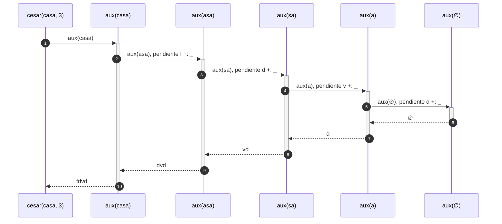
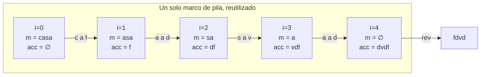
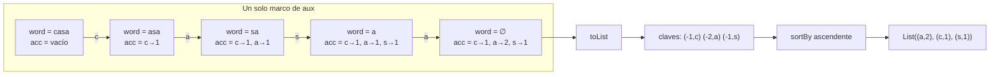
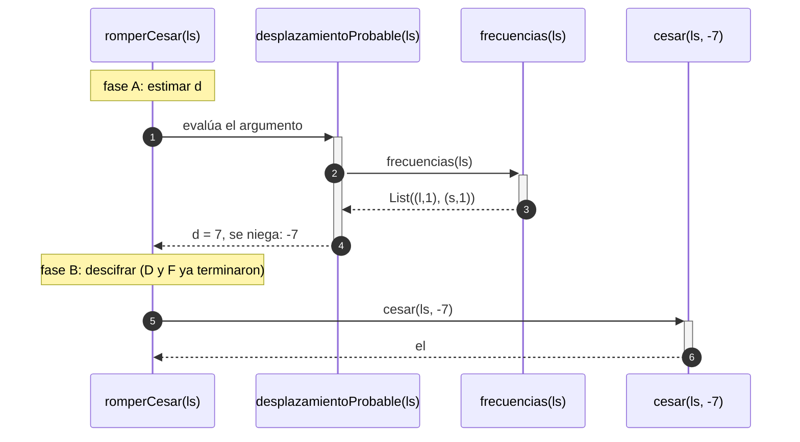
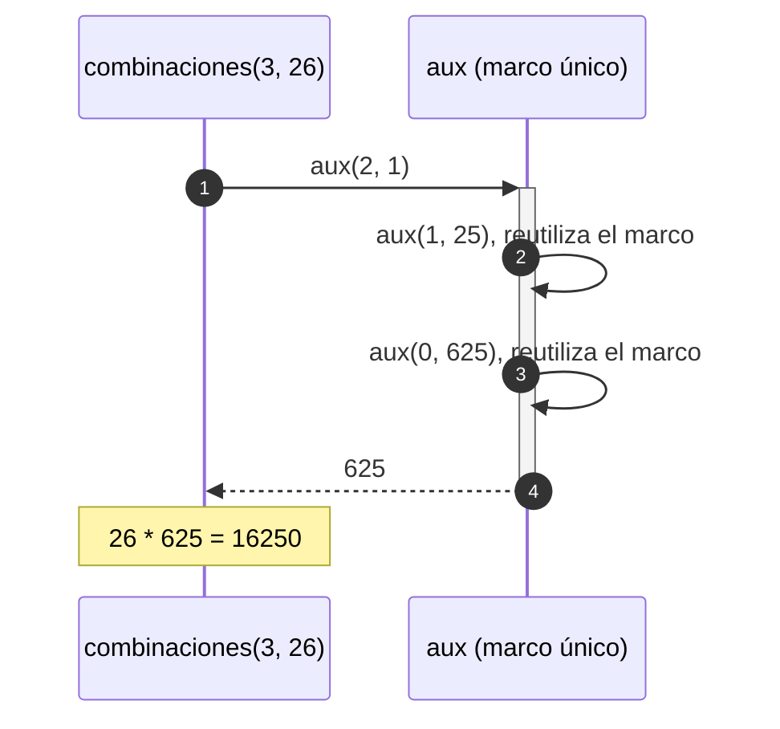
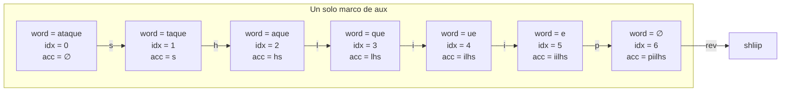

# Informe de corrección — Taller 1: cifrados clásicos con recursión

Este informe demuestra, con notación matemática, que cada función del taller cumple su especificación, y explica cómo se encadenan los llamados durante la ejecución. Complementa a `informe_proceso.md`, que muestra el estado de la pila paso a paso.

## Contenido

0. [Notación y convenciones](#0-notación-y-convenciones)
1. [Lemas básicos](#1-lemas-básicos)
2. [Punto 1: `cesar`](#2-punto-1-cesar)
3. [Punto 2: `cesarCola`](#3-punto-2-cesarcola)
4. [Punto 3: `frecuencias`](#4-punto-3-frecuencias)
5. [Punto 4: `desplazamientoProbable` y `romperCesar`](#5-punto-4-desplazamientoprobable-y-rompercesar)
6. [Punto 5: `combinaciones`](#6-punto-5-combinaciones)
7. [Punto 5: `vigenere`](#7-punto-5-vigenere)
8. [Pruebas y propiedades](#8-pruebas-y-propiedades)
9. [Alcance y precondiciones](#9-alcance-y-precondiciones)

---

## 0. Notación y convenciones

| Símbolo | Significado |
|---|---|
| $\Omega$ | Conjunto de todos los caracteres |
| $\Sigma=\{\mathtt{a},\dots,\mathtt{z}\}\subset\Omega$ | Las 26 letras minúsculas del alfabeto inglés |
| $\Omega^*$ | Cadenas (mensajes) sobre $\Omega$ |
| $\varepsilon$ | Cadena vacía (`""`) |
| $c\cdot s$ | Cadena que resulta de anteponer $c$ a $s$ (en el código, `c +: s`) |
| $s \mathbin{+\!\!+} t$ | Concatenación de $s$ con $t$ (en el código, `s ++ t`) |
| $\ell(s)$ | Longitud de $s$ |
| $\mathrm{rev}(s)$ | Cadena $s$ al revés (en el código, `s.reverse`) |
| $\mathrm{pos}:\Sigma\to\{0,\dots,25\}$ | Posición de la letra: $\mathrm{pos}(\mathtt{a})=0,\dots,\mathrm{pos}(\mathtt{z})=25$ |
| $\mathrm{chr}$ | Inversa de $\mathrm{pos}$ |
| $x \bmod 26$ | Residuo **matemático**, siempre en $\{0,\dots,25\}$ |
| $\mathrm{mod}^{+}(x)$ | Lo que calcula el código: `((x % 26) + 26) % 26` |

**Desplazamiento de un carácter.** Para $k\in\mathbb{Z}$ y $c\in\Omega$:

$$
\sigma_k(c)=
\begin{cases}
\mathrm{chr}\big((\mathrm{pos}(c)+k)\bmod 26\big) & \text{si } c\in\Sigma\\[2pt]
c & \text{si } c\notin\Sigma
\end{cases}
$$

**Extensión a cadenas.** $\hat\sigma_k:\Omega^*\to\Omega^*$ se define por recursión estructural:

$$
\hat\sigma_k(\varepsilon)=\varepsilon,\qquad
\hat\sigma_k(c\cdot t)=\sigma_k(c)\cdot\hat\sigma_k(t)
$$

Es decir, $\hat\sigma_k$ aplica $\sigma_k$ a cada carácter. Esta es la **especificación** del cifrado César.

**Conteo.** Para $s\in\Omega^*$ y $x\in\Sigma$, $N_s(x)$ es el número de posiciones de $s$ donde aparece $x$:

$$
N_\varepsilon(x)=0,\qquad
N_{c\cdot t}(x)=N_t(x)+[\,c=x\,]
$$

donde $[\,P\,]$ vale 1 si $P$ es cierta y 0 si no.

**Método de demostración.** Todas las funciones recursivas se verifican por **inducción estructural sobre la cadena** (o sobre el contador $n$, en `combinaciones`). Para la recursión de cola se demuestra primero un **lema de generalización** sobre el acumulador y luego se instancia con el valor inicial.

---

## 1. Lemas básicos

### Lema 1 (corrección de `moduloPositivo`)

Para todo $x\in\mathbb{Z}$ (en el rango de `Int` sin desbordamiento): $\mathrm{mod}^{+}(x)=x\bmod 26$.

**Demostración.** En Scala, `%` es el residuo truncado: $x=26q+r$ con $q$ el cociente truncado hacia cero y $-25\le r\le 25$. Por tanto $r\equiv x \pmod{26}$.

Entonces $r+26\in[1,51]$ es positivo y $r+26\equiv x\pmod{26}$. Para un número positivo, `%` coincide con el residuo matemático, así que $(r+26)\,\%\,26\in\{0,\dots,25\}$ y es congruente con $x$ módulo 26.

Como en $\{0,\dots,25\}$ hay un único representante de cada clase módulo 26, resulta $\mathrm{mod}^{+}(x)=x\bmod 26$. $\blacksquare$

### Lema 2 (corrección del cálculo de una letra)

Sea $c\in\Sigma$ y $k\in\mathbb{Z}$. La expresión del código

```scala
(primera + moduloPositivo(c - primera + k, letras)).toChar
```

es igual a $\sigma_k(c)$.

**Demostración.** `c - primera` es $\mathrm{pos}(c)$. Por el Lema 1, `moduloPositivo(pos(c)+k, 26)` es $(\mathrm{pos}(c)+k)\bmod 26$. Sumar `primera` (el código de `a`) y convertir a `Char` es aplicar $\mathrm{chr}$. $\blacksquare$

### Lema 3 (propiedades algebraicas de $\sigma$)

Para $a,b\in\mathbb{Z}$:

1. $\sigma_a\circ\sigma_b=\sigma_{a+b}$.
2. Si $a=26q$ con $q\in\mathbb{Z}$, entonces $\sigma_a$ es la identidad.
3. $\sigma_k$ restringida a $\Sigma$ es una **biyección** de $\Sigma$ en $\Sigma$, con inversa $\sigma_{-k}$.
4. Si $c\in\Sigma$, entonces $\sigma_j(c)=c\iff j\equiv 0\pmod{26}$.

**Demostración.**

1. Si $c\notin\Sigma$ ambos lados dan $c$. Si $c\in\Sigma$:
   $$\mathrm{pos}\big(\sigma_a(\sigma_b(c))\big)=\big((\mathrm{pos}(c)+b)\bmod 26+a\big)\bmod 26=(\mathrm{pos}(c)+a+b)\bmod 26$$
   porque $(x\bmod 26+a)\bmod 26=(x+a)\bmod 26$.
2. Es consecuencia de 1 y de que $(p+26q)\bmod 26=p$ para $p\in\{0,\dots,25\}$.
3. Por 1 y 2: $\sigma_{-k}\circ\sigma_k=\sigma_0=\mathrm{id}$ y $\sigma_k\circ\sigma_{-k}=\mathrm{id}$.
4. $(p+j)\bmod 26=p\iff 26\mid j$. $\blacksquare$

Por inducción sobre la cadena, 1 y 2 se extienden a $\hat\sigma$: $\hat\sigma_a\circ\hat\sigma_b=\hat\sigma_{a+b}$ y $\hat\sigma_{26q}=\mathrm{id}$.

### Lema 4 (el cifrado preserva los conteos)

Sea $m=\hat\sigma_k(o)$. Para todo $x\in\Sigma$: $N_m(\sigma_k(x))=N_o(x)$.

**Demostración.** Por inducción sobre $o$. Si $o=\varepsilon$, ambos lados son 0. Si $o=c\cdot t$, entonces $m=\sigma_k(c)\cdot\hat\sigma_k(t)$ y

$$N_m(\sigma_k(x))=N_{\hat\sigma_k(t)}(\sigma_k(x))+[\,\sigma_k(c)=\sigma_k(x)\,]=N_t(x)+[\,c=x\,]=N_o(x)$$

El segundo paso usa la hipótesis de inducción y que $\sigma_k$ es inyectiva en $\Sigma$ (Lema 3.3); además, si $c\notin\Sigma$ entonces $\sigma_k(c)=c\notin\Sigma$ y nunca coincide con $\sigma_k(x)\in\Sigma$. $\blacksquare$

---

## 2. Punto 1: `cesar`

### Especificación

$$\texttt{cesar}(m,k)=\hat\sigma_k(m)\qquad\text{para todo } m\in\Omega^*,\ k\in\mathbb{Z}$$

### Teorema 1 (corrección de `cesar`)

La función interna `aux` del código cumple $\texttt{aux}(s)=\hat\sigma_k(s)$ para todo $s\in\Omega^*$. En consecuencia, $\texttt{cesar}(m,k)=\texttt{aux}(m)=\hat\sigma_k(m)$.

**Demostración.** Por inducción sobre $\ell(s)$, con $k$ fijo.

*Caso base* ($s=\varepsilon$): el código devuelve `""`, que es $\varepsilon=\hat\sigma_k(\varepsilon)$.

*Paso inductivo* ($s=c\cdot t$, con la hipótesis $\texttt{aux}(t)=\hat\sigma_k(t)$):

- Si $c\in\Sigma$: el código devuelve `letraCifrada +: aux(t)`, y por el Lema 2 `letraCifrada` $=\sigma_k(c)$. Así
  $$\texttt{aux}(s)=\sigma_k(c)\cdot\texttt{aux}(t)=\sigma_k(c)\cdot\hat\sigma_k(t)=\hat\sigma_k(c\cdot t)$$
- Si $c\notin\Sigma$: el código devuelve `c +: aux(t)`, y como $\sigma_k(c)=c$,
  $$\texttt{aux}(s)=c\cdot\hat\sigma_k(t)=\sigma_k(c)\cdot\hat\sigma_k(t)=\hat\sigma_k(s)\ \blacksquare$$

**Terminación.** Cada llamada recibe `word.tail`, con $\ell(\texttt{word.tail})=\ell(\texttt{word})-1$. La medida $\ell\in\mathbb{N}$ decrece estrictamente y la recursión se detiene en $\ell=0$. Para $\ell(m)=n$ se hacen exactamente $n+1$ llamadas a `aux`.

### Cómo se encadenan los llamados

Cada llamada **espera** el resultado de la siguiente antes de poder anteponer su letra. Desarrollando la definición para `cesar("casa", 3)` (con $\mathtt{aux}$ abreviado como $A$):

$$
\begin{aligned}
A(\mathtt{casa}) &= \mathtt{f}\cdot A(\mathtt{asa})\\
&= \mathtt{f}\cdot\mathtt{d}\cdot A(\mathtt{sa})\\
&= \mathtt{f}\cdot\mathtt{d}\cdot\mathtt{v}\cdot A(\mathtt{a})\\
&= \mathtt{f}\cdot\mathtt{d}\cdot\mathtt{v}\cdot\mathtt{d}\cdot A(\varepsilon)\\
&= \mathtt{f}\cdot\mathtt{d}\cdot\mathtt{v}\cdot\mathtt{d}\cdot\varepsilon=\mathtt{fdvd}
\end{aligned}
$$

Las cuatro primeras igualdades son las **llamadas** (se bajan); sólo al llegar a $A(\varepsilon)$ se pueden resolver las anteposiciones, de derecha a izquierda (se sube).



**Consecuencia para la pila.** Cada llamada con $\ell(s)\ge 1$ deja una continuación pendiente (la anteposición). En el punto más profundo hay $\ell(m)+1$ marcos de `aux` vivos, más el de `cesar`:

$$P_{\text{lineal}}(n)=n+2$$

La pila crece **linealmente** con la longitud del mensaje.

---

## 3. Punto 2: `cesarCola`

### Especificación

$$\texttt{cesarCola}(m,k,\varepsilon)=\hat\sigma_k(m)=\texttt{cesar}(m,k)$$

### Lema 5 (generalización con acumulador)

Para todo $s\in\Omega^*$, $k\in\mathbb{Z}$ y $acc\in\Omega^*$:

$$\texttt{cesarCola}(s,k,acc)=\mathrm{rev}(acc)\mathbin{+\!\!+}\hat\sigma_k(s)$$

**Demostración.** Por inducción sobre $\ell(s)$, **con $acc$ cuantificado universalmente** (no fijo).

*Caso base* ($s=\varepsilon$): el código devuelve `acc.reverse`, que es $\mathrm{rev}(acc)=\mathrm{rev}(acc)\mathbin{+\!\!+}\varepsilon$.

*Paso inductivo* ($s=c\cdot t$). Sea $x=\sigma_k(c)$ (por el Lema 2 si $c\in\Sigma$; si no, $x=c=\sigma_k(c)$). El código hace la llamada `cesarCola(t, k, x +: acc)`. Por hipótesis de inducción, aplicada al acumulador $x\cdot acc$:

$$
\begin{aligned}
\texttt{cesarCola}(c\cdot t,k,acc)
&=\mathrm{rev}(x\cdot acc)\mathbin{+\!\!+}\hat\sigma_k(t)\\
&=\big(\mathrm{rev}(acc)\mathbin{+\!\!+}x\big)\mathbin{+\!\!+}\hat\sigma_k(t)
&&\text{pues }\mathrm{rev}(x\cdot acc)=\mathrm{rev}(acc)\mathbin{+\!\!+}x\\
&=\mathrm{rev}(acc)\mathbin{+\!\!+}\big(\sigma_k(c)\cdot\hat\sigma_k(t)\big)\\
&=\mathrm{rev}(acc)\mathbin{+\!\!+}\hat\sigma_k(c\cdot t)\ \blacksquare
\end{aligned}
$$

### Teorema 2 (corrección y equivalencia con `cesar`)

Para todo $m$ y $k$: $\texttt{cesarCola}(m,k,\varepsilon)=\hat\sigma_k(m)=\texttt{cesar}(m,k)$.

**Demostración.** Se instancia el Lema 5 con $acc=\varepsilon$, y $\mathrm{rev}(\varepsilon)=\varepsilon$. La igualdad con `cesar` es el Teorema 1. $\blacksquare$

**Terminación.** Igual que antes: $\ell(m)$ decrece en 1 en cada llamada.

### Invariante del bucle

Sea $m=c_1c_2\cdots c_n$. En la llamada número $i$ (con $i=0,\dots,n$), los argumentos cumplen:

$$
m_i=c_{i+1}\cdots c_n,\qquad acc_i=\mathrm{rev}\big(\hat\sigma_k(c_1\cdots c_i)\big)
$$

y la invariante $\mathrm{rev}(acc_i)\mathbin{+\!\!+}\hat\sigma_k(m_i)=\hat\sigma_k(m)$ se conserva en todas las llamadas. Para `cesarCola("casa", 3)`:

| Llamada $i$ | $m_i$ | $acc_i$ | $\mathrm{rev}(acc_i)$ (ya cifrado) |
|---|---|---|---|
| 0 | `casa` | `∅` | `∅` |
| 1 | `asa` | `f` | `f` |
| 2 | `sa` | `df` | `fd` |
| 3 | `a` | `vdf` | `fdv` |
| 4 | `∅` | `dvdf` | `fdvd` |

### Cómo se encadenan los llamados

Cada llamada **termina** en la siguiente: su valor es el valor de la siguiente llamada, sin operaciones intermedias:

$$
\begin{aligned}
\texttt{cesarCola}(\mathtt{casa},3,\varepsilon)
&=\texttt{cesarCola}(\mathtt{asa},3,\mathtt{f})\\
&=\texttt{cesarCola}(\mathtt{sa},3,\mathtt{df})\\
&=\texttt{cesarCola}(\mathtt{a},3,\mathtt{vdf})\\
&=\texttt{cesarCola}(\varepsilon,3,\mathtt{dvdf})\\
&=\mathrm{rev}(\mathtt{dvdf})=\mathtt{fdvd}
\end{aligned}
$$

Aquí no hay "subida": el resultado ya está completo en el último acumulador y sólo se invierte.



### Por qué esta pila no crece

La llamada recursiva es la **última** acción de la función y su valor es directamente el valor de retorno: no queda ninguna continuación pendiente en el marco actual. Por eso el compilador (con `@tailrec`) lo transforma en un ciclo que actualiza $(m,acc)$ en el mismo marco:

$$P_{\text{cola}}(n)=1\quad\text{para todo } n$$

| | `cesar` | `cesarCola` |
|---|---|---|
| Valor de la llamada recursiva | $\sigma_k(c)\cdot\texttt{aux}(t)$ (hay trabajo después de volver) | la llamada misma (no hay trabajo después) |
| Continuaciones pendientes | $n+1$ | 0 |
| Profundidad de pila | $n+2$ | $1$ |

---

## 4. Punto 3: `frecuencias`

### Especificación

$\texttt{frecuencias}(m)$ es la lista $L$ de pares $(x,N_m(x))$ con $x\in\Sigma$ y $N_m(x)>0$, sin repeticiones, ordenada según la relación

$$(x,f)\prec(y,g)\iff f>g\ \ \lor\ \ (f=g\ \land\ x<y)$$

es decir: de mayor a menor frecuencia y, en empate, por orden alfabético.

### Lema 6 (el recorrido cuenta correctamente)

Para un mapa $acc$, sea $\bar a(x)$ su valor en $x$ si $x\in\mathrm{dom}(acc)$, y 0 si no. Para todo $s\in\Omega^*$, $\texttt{aux}(s,acc)=R$ cumple:

1. $\bar R(x)=\bar a(x)+N_s(x)$ para todo $x\in\Sigma$.
2. $\mathrm{dom}(R)=\mathrm{dom}(acc)\cup\{x\in\Sigma: N_s(x)>0\}$.

**Demostración.** Por inducción sobre $\ell(s)$, con $acc$ universal.

*Caso base* ($s=\varepsilon$): $R=acc$ y $N_\varepsilon=0$.

*Paso* ($s=c\cdot t$):

- Si $c\in\Sigma$: se llama con $acc'=acc+(c\mapsto\bar a(c)+1)$, de modo que $\bar a'(x)=\bar a(x)+[\,c=x\,]$ y $\mathrm{dom}(acc')=\mathrm{dom}(acc)\cup\{c\}$. Por hipótesis de inducción,
  $$\bar R(x)=\bar a'(x)+N_t(x)=\bar a(x)+[\,c=x\,]+N_t(x)=\bar a(x)+N_s(x)$$
  y el dominio resulta $\mathrm{dom}(acc)\cup\{c\}\cup\{x:N_t(x)>0\}=\mathrm{dom}(acc)\cup\{x:N_s(x)>0\}$.
- Si $c\notin\Sigma$: $acc'=acc$ y $N_s=N_t$ sobre $\Sigma$; ambas afirmaciones se obtienen directamente de la hipótesis. $\blacksquare$

### Teorema 3 (corrección de `frecuencias`)

El resultado cumple la especificación.

**Demostración.** Con $acc=\emptyset$ (donde $\bar a=0$), el Lema 6 da un mapa $R$ con dominio $\{x\in\Sigma:N_m(x)>0\}$ y $R(x)=N_m(x)$. Eso garantiza que están **todas** las letras que aparecen, **ninguna** repetida (es un mapa) y **ninguna** que no aparezca.

Para el orden, `sortBy(w => (-w._2, w._1))` ordena por la clave $\kappa(x,f)=(-f,\,x)$ con orden lexicográfico. Entonces

$$\kappa(x,f)<\kappa(y,g)\iff -f<-g\ \lor\ (-f=-g\ \land\ x<y)\iff (x,f)\prec(y,g)$$

Como las letras de la lista son distintas, $\kappa$ es inyectiva: no hay dos elementos con la misma clave, por lo que el orden resultante es **único** y coincide con $\prec$. $\blacksquare$

**Terminación.** $\ell(\texttt{word})$ decrece en 1 en cada llamada de `aux`.

### Cómo se encadenan los llamados

Con $m=\mathtt{casa}$, la cadena de llamadas de cola va actualizando el mapa:



La invariante del Lema 6 se lee así: en cada llamada, $acc$ contiene los conteos de la parte de la cadena ya recorrida, y $N_s$ los de la parte pendiente; su suma es siempre $N_m$.

---

## 5. Punto 4: `desplazamientoProbable` y `romperCesar`

### Especificación

Sea $m\in\Omega^*$. Si $m$ no tiene letras, $d(m)=0$. Si tiene, sea $x^*$ la **primera letra** de $\texttt{frecuencias}(m)$, es decir, la de mayor frecuencia y, en empate, la menor alfabéticamente. Entonces

$$d(m)=\big(\mathrm{pos}(x^*)-\mathrm{pos}(\mathtt{e})\big)\bmod 26=\big(\mathrm{pos}(x^*)-4\big)\bmod 26$$

y $\texttt{romperCesar}(m)=\hat\sigma_{-d(m)}(m)$.

### Teorema 4 (corrección de `desplazamientoProbable`)

$\texttt{desplazamientoProbable}(m)=d(m)\in\{0,\dots,25\}$.

**Demostración.** Si `frecuencias(m)` es vacía, el código devuelve 0, que es $d(m)$ para un mensaje sin letras. Si no, toma `frecuenciasWords.head._1`, que por el Teorema 3 es $x^*$, y calcula `moduloPositivo(x* - 'e', letras)`. Como `x* - 'e'` es $\mathrm{pos}(x^*)-4$, el Lema 1 da $\big(\mathrm{pos}(x^*)-4\big)\bmod 26$. $\blacksquare$

*Ejemplo:* en `"hhhaaa"` hay empate $N(\mathtt{a})=N(\mathtt{h})=3$; gana `a` por orden alfabético, y $d=(0-4)\bmod 26=22$.

### Teorema 5 (qué hace `romperCesar`)

Sean $o\in\Omega^*$ con al menos una letra, $k\in\mathbb{Z}$, $m=\hat\sigma_k(o)$ y $d=d(m)$. Entonces:

$$\texttt{romperCesar}(m)=\hat\sigma_{k-d}(o)$$

**Demostración.** `romperCesar(m)` es `cesar(m, -d)`, que por el Teorema 1 es $\hat\sigma_{-d}(m)=\hat\sigma_{-d}\big(\hat\sigma_k(o)\big)$. Por el Lema 3.1 (extendido a cadenas), esto es $\hat\sigma_{k-d}(o)$. $\blacksquare$

### Teorema 6 (condición necesaria y suficiente de éxito)

Con las hipótesis del Teorema 5:

$$\texttt{romperCesar}(\hat\sigma_k(o))=o\iff d\equiv k\pmod{26}\iff x^*=\sigma_k(\mathtt{e})$$

**Demostración.**

- ($\Leftarrow$ de la primera equivalencia) Si $d\equiv k$, entonces $k-d=26q$ y por el Lema 3.2 $\hat\sigma_{k-d}=\mathrm{id}$; por el Teorema 5 el resultado es $o$.
- ($\Rightarrow$) Sea $c$ una letra de $o$. Si $\hat\sigma_{k-d}(o)=o$, entonces $\sigma_{k-d}(c)=c$, y por el Lema 3.4 $k-d\equiv 0\pmod{26}$.
- (segunda equivalencia) $d\equiv k\iff \mathrm{pos}(x^*)-4\equiv k\iff \mathrm{pos}(x^*)\equiv 4+k \pmod{26}$. Como $\mathrm{pos}(x^*)\in\{0,\dots,25\}$ es el único representante, esto equivale a $x^*=\mathrm{chr}\big((4+k)\bmod 26\big)=\sigma_k(\mathtt{e})$. $\blacksquare$

### Corolario 7 (condición suficiente práctica)

Si la `e` es estrictamente la letra más frecuente de $o$, es decir $N_o(\mathtt{e})>N_o(x)$ para todo $x\in\Sigma\setminus\{\mathtt{e}\}$, entonces $\texttt{romperCesar}(\hat\sigma_k(o))=o$ para todo $k$.

**Demostración.** Por el Lema 4, $N_m(\sigma_k(x))=N_o(x)$ para toda $x\in\Sigma$, y $\sigma_k$ es biyección de $\Sigma$ (Lema 3.3). Entonces $\sigma_k(\mathtt{e})$ es la **única** letra de $m$ con frecuencia máxima, así que es la primera de `frecuencias(m)`: $x^*=\sigma_k(\mathtt{e})$. Se aplica el Teorema 6. $\blacksquare$

(Un empate también es inofensivo si $\sigma_k(\mathtt{e})$ resulta ser la menor alfabéticamente entre las letras empatadas del mensaje **cifrado**.)

### Condiciones en las que el método falla

Por el Teorema 6, el método **falla exactamente cuando** $x^*\ne\sigma_k(\mathtt{e})$. Eso ocurre si en $o$:

1. **Otra letra es más frecuente que la `e`:** existe $x\ne\mathtt{e}$ con $N_o(x)>N_o(\mathtt{e})$; o
2. **Hay empate** con la `e` y, en el mensaje cifrado, la letra empatada que corresponde a otra queda antes alfabéticamente que $\sigma_k(\mathtt{e})$.

Cuando falla, por el Teorema 5 el resultado no es "algo aleatorio" sino $\hat\sigma_{k-d}(o)$: el original corrido $(k-d)\bmod 26\ne 0$ posiciones.

### Mensajes concretos donde falla

**Ejemplo A: otra letra domina.** $o=\mathtt{cada\ casa\ amarilla}$, $k=7$.

- Conteos: $N_o(\mathtt{a})=2+2+3=7$ y $N_o(\mathtt{e})=0$.
- Cifrado: la `a` pasa a `h`, que sigue siendo la única más frecuente, así que $x^*=\mathtt{h}$.
- $d=(7-4)\bmod 26=3$, pero $k=7$, así que $k-d=4\not\equiv 0$.
- Resultado: $\hat\sigma_4(o)=\mathtt{gehe\ gewe\ eqevmppe}\ne o$.

**Ejemplo B: sólo una letra, que no es `e`.** $o=\mathtt{zzzz\ zzzz\ zzzz}$, $k=3$.

- Cifrado: `cccc cccc cccc`, con $x^*=\mathtt{c}$.
- $d=(2-4)\bmod 26=24$, y $k-d=-21\equiv 5$.
- Resultado: $\hat\sigma_{5}(o)=\mathtt{eeee\ eeee\ eeee}\ne o$.

**Ejemplo C: empate.** $o=\mathtt{eeaa}$, $k=0$.

- $N_o(\mathtt{e})=N_o(\mathtt{a})=2$; el empate se resuelve a favor de `a` (menor alfabéticamente), así que $x^*=\mathtt{a}$.
- $d=(0-4)\bmod 26=22$ y $k-d=-22\equiv 4$.
- Resultado: $\hat\sigma_4(\mathtt{eeaa})=\mathtt{iiee}\ne\mathtt{eeaa}$.

### Cómo se encadenan los llamados

`romperCesar` evalúa **primero** el argumento (`desplazamientoProbable`) y **después** llama a `cesar`; los dos subprocesos no coexisten en la pila. Ejemplo con $m=\mathtt{ls}$ ($=\hat\sigma_7(\mathtt{el})$):

$$
\begin{aligned}
d(\mathtt{ls})&=\big(\mathrm{pos}(\mathtt{l})-4\big)\bmod 26=(11-4)\bmod 26=7\\
\texttt{romperCesar}(\mathtt{ls})&=\hat\sigma_{-7}(\mathtt{ls})=\sigma_{-7}(\mathtt{l})\cdot\sigma_{-7}(\mathtt{s})=\mathtt{e}\cdot\mathtt{l}=\mathtt{el}
\end{aligned}
$$

En el cálculo de $d$ hay empate entre `l` y `s` (cada una con 1) y gana `l`, que es menor alfabéticamente.



---

## 6. Punto 5: `combinaciones`

### Especificación

Para $n\ge 0$ y $a\ge 0$, $C(n,a)$ es el número de mensajes de longitud $n$ sobre $a$ letras sin dos letras iguales seguidas, con

$$C(0,a)=1,\qquad C(1,a)=a,\qquad C(n,a)=(a-1)\,C(n-1,a)\ \ (n>1)$$

### Lema 8 (forma cerrada)

Para $n\ge 1$: $C(n,a)=a\,(a-1)^{n-1}$ (con la convención $0^0=1$).

**Demostración.** Por inducción sobre $n$. Para $n=1$: $a(a-1)^0=a=C(1,a)$. Para $n>1$, con la hipótesis para $n-1$:

$$C(n,a)=(a-1)\,C(n-1,a)=(a-1)\cdot a\,(a-1)^{n-2}=a\,(a-1)^{n-1}\ \blacksquare$$

*Justificación combinatoria:* la primera letra se elige entre $a$ opciones y cada una de las $n-1$ siguientes entre $a-1$ (cualquiera menos la anterior).

### Lema 9 (invariante de `aux`)

Para todo $j\ge 0$ y todo $acc\in\mathbb{N}$ (tipo `BigInt`): $\texttt{aux}(j,acc)=acc\cdot(a-1)^j$.

**Demostración.** Por inducción sobre $j$, con $acc$ universal.

*Base* ($j=0$): el código devuelve `acc`, que es $acc\cdot(a-1)^0$.

*Paso* ($j>0$): el código llama a $\texttt{aux}(j-1,\ acc\cdot(a-1))$. Por hipótesis de inducción:

$$\texttt{aux}(j,acc)=\big(acc\cdot(a-1)\big)(a-1)^{j-1}=acc\cdot(a-1)^j\ \blacksquare$$

### Teorema 10 (corrección de `combinaciones`)

Para $n\ge 0$: $\texttt{combinaciones}(n,a)=C(n,a)$.

**Demostración.**

- $n=0$: el código devuelve `BigInt(1)` $=C(0,a)$.
- $n\ge 1$: el código devuelve $a\cdot\texttt{aux}(n-1,1)$. Por el Lema 9, $\texttt{aux}(n-1,1)=1\cdot(a-1)^{n-1}$, y el resultado es $a(a-1)^{n-1}$, que es $C(n,a)$ por el Lema 8. $\blacksquare$

*Verificación numérica:* $C(3,26)=26\cdot 25^2=26\cdot 625=16250$ y $C(2,2)=2\cdot 1^1=2$. Para $a=1$ y $n\ge 2$ resulta $1\cdot 0^{n-1}=0$.

**Terminación.** El argumento `n_aux` decrece en 1 y la recursión se detiene en 0 si $n\ge 0$. (Para $n<0$ no termina; ver sección 9.)

### Cómo se encadenan los llamados

Para $\texttt{combinaciones}(3,26)$ la cadena de `aux` es de cola y el acumulador va multiplicándose por $a-1=25$:

$$
\begin{aligned}
\texttt{aux}(2,1)&=\texttt{aux}(1,\,1\cdot 25)=\texttt{aux}(1,25)\\
&=\texttt{aux}(0,\,25\cdot 25)=\texttt{aux}(0,625)=625
\end{aligned}
$$

y `combinaciones` multiplica por 26 al volver: $26\cdot 625=16250$.



La pila tiene siempre 2 marcos (`combinaciones` esperando y un `aux`), sin importar $n$.

---

## 7. Punto 5: `vigenere`

### Especificación

Sea $K=k_0k_1\cdots k_{L-1}$ con $L\ge 1$ la clave, y $m=c_1\cdots c_n$. Se define $\iota(i)$ como el número de letras del mensaje **antes** de la posición $i$:

$$\iota(i)=\#\{\,j<i : c_j\in\Sigma\,\}$$

Entonces $\texttt{vigenere}(m,K)=y_1\cdots y_n$ con

$$
y_i=
\begin{cases}
\sigma_{\mathrm{pos}\left(k_{\iota(i)\bmod L}\right)}(c_i) & \text{si } c_i\in\Sigma\\[2pt]
c_i & \text{si } c_i\notin\Sigma
\end{cases}
$$

Si $K=\varepsilon$, el resultado es $m$. Un carácter que no es letra no consume clave: no incrementa $\iota$.

### Lema 11 (invariante de `aux`)

Se define $V(s,j)$ por recursión sobre $s$ (con $j$ el índice de clave actual):

$$
V(\varepsilon,j)=\varepsilon,\qquad
V(c\cdot t,j)=
\begin{cases}
\sigma_{\mathrm{pos}\left(k_{j\bmod L}\right)}(c)\cdot V(t,j+1) & c\in\Sigma\\[2pt]
c\cdot V(t,j) & c\notin\Sigma
\end{cases}
$$

Entonces, para todo $s$, $j\ge 0$ y $acc$:

$$\texttt{aux}(s,j,acc)=\mathrm{rev}(acc)\mathbin{+\!\!+}V(s,j)$$

**Demostración.** Por inducción sobre $\ell(s)$, con $j$ y $acc$ universales.

*Base* ($s=\varepsilon$): el código devuelve `acc.reverse` $=\mathrm{rev}(acc)\mathbin{+\!\!+}\varepsilon$.

*Paso* ($s=c\cdot t$):

- Si $c\in\Sigma$: el desplazamiento es $k=\mathrm{pos}(\texttt{clave(idx \% L)})$ y la letra cifrada es $x=\sigma_k(c)$ (Lema 2). El código llama a $\texttt{aux}(t,\,j+1,\,x\cdot acc)$. Por hipótesis de inducción y por $\mathrm{rev}(x\cdot acc)=\mathrm{rev}(acc)\mathbin{+\!\!+}x$:
  $$\texttt{aux}(s,j,acc)=\mathrm{rev}(acc)\mathbin{+\!\!+}x\mathbin{+\!\!+}V(t,j+1)=\mathrm{rev}(acc)\mathbin{+\!\!+}V(s,j)$$
- Si $c\notin\Sigma$: el código llama a $\texttt{aux}(t,\,j,\,c\cdot acc)$ (el índice **no** avanza) y se razona igual, obteniendo $\mathrm{rev}(acc)\mathbin{+\!\!+}c\mathbin{+\!\!+}V(t,j)$. $\blacksquare$

### Teorema 12 (corrección de `vigenere`)

$\texttt{vigenere}(m,K)=V(m,0)$, y $V(m,0)$ cumple la especificación.

**Demostración.** Con $K\neq\varepsilon$, `vigenere` llama a `aux(m)` con `idx = 0` y `acc = ""`. El Lema 11 da $\mathrm{rev}(\varepsilon)\mathbin{+\!\!+}V(m,0)=V(m,0)$.

Para ver que $V(m,0)$ es la especificación, se prueba por inducción sobre $\ell(s)$ que, al procesar un sufijo que empieza en la posición $i$ con índice de clave $j=\iota(i)$, el carácter $c_i$ se cifra con $k_{\iota(i)\bmod L}$: al avanzar de $i$ a $i+1$ el índice sube exactamente en $[\,c_i\in\Sigma\,]$, que es la definición de $\iota(i+1)=\iota(i)+[\,c_i\in\Sigma\,]$. Si $K=\varepsilon$, el código devuelve `m`, como pide el enunciado. $\blacksquare$

**Terminación.** $\ell(\texttt{word})$ decrece en 1 en cada llamada.

### Corolario 13 (clave de una letra)

Si $K$ tiene una sola letra $\kappa$, entonces $\texttt{vigenere}(m,\kappa)=\hat\sigma_{\mathrm{pos}(\kappa)}(m)=\texttt{cesar}(m,\mathrm{pos}(\kappa))$.

**Demostración.** Con $L=1$ se tiene $\iota(i)\bmod 1=0$ para todo $i$, así que todas las letras se desplazan por $\mathrm{pos}(k_0)$, y por el Teorema 1 coincide con `cesar`. $\blacksquare$

### Cómo se encadenan los llamados

Para $\texttt{vigenere}(\mathtt{ataque},\mathtt{sol})$, con desplazamientos $18,14,11$ y $\mathrm{pos}$ de `a,t,a,q,u,e` $=0,19,0,16,20,4$:

$$
\begin{aligned}
y_1&=(0+18)\bmod 26=18\to\mathtt{s}, &
y_2&=(19+14)\bmod 26=7\to\mathtt{h}, &
y_3&=(0+11)\bmod 26=11\to\mathtt{l},\\
y_4&=(16+18)\bmod 26=8\to\mathtt{i}, &
y_5&=(20+14)\bmod 26=8\to\mathtt{i}, &
y_6&=(4+11)\bmod 26=15\to\mathtt{p}
\end{aligned}
$$

La cadena de llamadas de cola con el índice y el acumulador:



**Caso con espacio.** En `vigenere("hola mundo", "ab")` el espacio ocupa la posición 5 pero $\iota(5)=4=\iota(6)$, es decir, no incrementa el índice. Por eso la `m` usa $k_{4\bmod 2}=k_0=\mathtt{a}$ y el resultado es `hplb mvneo`.

---

## 8. Pruebas y propiedades

Cada grupo de pruebas del archivo de tests comprueba una propiedad demostrada arriba:

| Propiedad demostrada | Pruebas que la ejercitan |
|---|---|
| Teorema 1 (especificación de `cesar`) | `casa`→`fdvd`; `zzz`→`aaa`; $k=29$; $k=-29$; $k=26,52$; $k=0$; mayúsculas y símbolos sin cambio; misma longitud |
| Lema 3.1 y 3.2 (composición, periodicidad) | cifrar y descifrar es la identidad; $k=26$ y $k=52$ no cambian el mensaje |
| Teorema 2 (equivalencia `cesarCola` = `cesar`) | comparación sobre una lista de casos; $k=-100$; mensaje largo (`@tailrec`, pila constante) |
| Teorema 3 (`frecuencias`) | orden por frecuencia, desempate alfabético, mayúsculas ignoradas, sin letras da `List()` |
| Teorema 4 (`desplazamientoProbable`) | $e\to 0$, $f\to 1$, $a\to 22$, $z\to 21$, empate `hhhaaa`$\to 22$, sin letras $\to 0$ |
| Corolario 7 (éxito de `romperCesar`) | `el mensaje secreto` con $k=7$; textos largos con $k=1$ y $k=13$ |
| Teorema 6 (fallos de `romperCesar`) | `cada casa amarilla` con $k=7$; `zzzz zzzz zzzz` con $k=3$ |
| Teorema 10 (`combinaciones`) | $C(0,26)=1$, $C(1,26)=26$, $C(3,26)=16250$, $C(2,2)=2$, $a=1$ da 0, recurrencia |
| Teorema 12 y Corolario 13 (`vigenere`) | `ataque`/`sol`; `hola mundo`/`ab`; clave vacía; espacio, dígitos y mayúsculas no consumen clave; clave de una letra igual a `cesar` |

---

## 9. Alcance y precondiciones

Las demostraciones valen bajo estas hipótesis, que conviene declarar:

1. **Alfabeto:** sólo se cifran las 26 minúsculas inglesas. Cualquier otro carácter pasa sin cambio, por definición de $\sigma_k$.
2. **Desbordamiento de `Int`:** el Lema 1 supone que `c - primera + k` no desborda `Int`. Se cumple para todo $k$ con $\lvert k\rvert\le 2^{31}-27$.
3. **`combinaciones`:** se exige $n\ge 0$. Para $n<0$, la recursión de `aux` nunca llega a 0 y no termina.
4. **`vigenere`:** la clave se supone formada por minúsculas; la clave vacía se trata aparte (devuelve el mensaje sin cambio).
5. **`@tailrec`:** la anotación no cambia el resultado, sólo hace que el compilador **verifique** que la llamada recursiva está en posición de cola. Debe estar presente en `cesarCola` (lo exige el enunciado) y conviene en los `aux` de cola.
6. **`romperCesar`:** es correcta como **estimador**: devuelve $\hat\sigma_{k-d}(o)$, y recupera el original si y sólo si $x^*=\sigma_k(\mathtt{e})$ (Teorema 6). Que falle en ciertos mensajes no es un error de implementación, sino una limitación del método de análisis de frecuencias.
