# Informe de proceso — Taller 1: cifrados clásicos con recursión

Este informe explica, para cada función del taller, cómo se ejecuta paso a paso y cuál es el estado de la pila de llamados en cada momento. Los puntos 1 y 2 (los que el enunciado pide de forma explícita) se desarrollan con más detalle; los puntos 3, 4 y 5 siguen el mismo formato.

## Contenido

0. [Convenciones y fórmulas](#0-convenciones-y-fórmulas)
1. [Punto 1: `cesar` (recursión lineal)](#1-punto-1-cesar-recursión-lineal)
2. [Punto 2: `cesarCola` (recursión de cola)](#2-punto-2-cesarcola-recursión-de-cola)
3. [Punto 3: `frecuencias`](#3-punto-3-frecuencias)
4. [Punto 4: `desplazamientoProbable` y `romperCesar`](#4-punto-4-desplazamientoprobable-y-rompercesar)
5. [Punto 5: `combinaciones` y `vigenere`](#5-punto-5-combinaciones-y-vigenere)
6. [Resumen y observaciones](#6-resumen-y-observaciones)
7. [Anexo: cuándo falla `romperCesar`](#anexo-cuándo-falla-rompercesar)

---

## 0. Convenciones y fórmulas

### Cómo leer las trazas y los diagramas

- Un **marco de pila** es una llamada activa a una función.
- En las tablas de pila, los marcos se listan de la **cima a la base**: el primero es el que se está ejecutando.
- Una llamada **pendiente** ya empezó, pero no puede terminar hasta que la llamada que está encima devuelva su resultado.
- En los diagramas, los mensajes se escriben **sin comillas** (por ejemplo `casa` representa `"casa"` y `∅` representa la cadena vacía `""`).
- En los diagramas de secuencia, la barra de activación de cada participante representa su marco en la pila: mientras la barra está abierta, el marco sigue en la pila.

### Fórmulas usadas

Con las letras numeradas de $a=0$ a $z=25$, cifrar una letra en posición $p$ con desplazamiento $k$ es:

$$p' = (p + k) \bmod 26$$

En Scala, el operador `%` puede dar resultados negativos (por ejemplo `-1 % 26` da `-1`). Por eso el código usa la función auxiliar `moduloPositivo`, que implementa:

$$\operatorname{mod}^{+}(n) = \big((n \bmod 26) + 26\big) \bmod 26$$

que siempre da un valor en $[0, 25]$, incluso con $k$ negativo o $k > 26$.

El número de mensajes de longitud $n$ sobre un alfabeto de $a$ letras sin dos iguales seguidas cumple:

$$C(n,a) = (a-1)\cdot C(n-1,a), \qquad C(0,a)=1,\quad C(1,a)=a$$

Al desarrollar la recurrencia queda la forma cerrada:

$$C(n,a) = a\,(a-1)^{n-1} \quad (n \ge 1)$$

Posiciones de referencia: $a=0,\ b=1,\ c=2,\ e=4,\ h=7,\ l=11,\ o=14,\ s=18,\ v=21,\ z=25$.

---

## 1. Punto 1: `cesar` (recursión lineal)

### 1.1 Idea del código

`cesar` define una función interna `aux(word)` que procesa el mensaje así:

1. **Caso base:** si `word` está vacía, devuelve `""`.
2. **Caso letra minúscula:** calcula la letra cifrada y la **antepone** (`+:`) al resultado de `aux(word.tail)`.
3. **Otro carácter:** antepone el carácter sin cambio al resultado de `aux(word.tail)`.

La llamada recursiva **no es lo último que se hace**: cuando `aux(word.tail)` devuelve, todavía hay que ejecutar el `+:`. Por eso cada letra deja una operación pendiente y su marco no puede liberarse todavía.

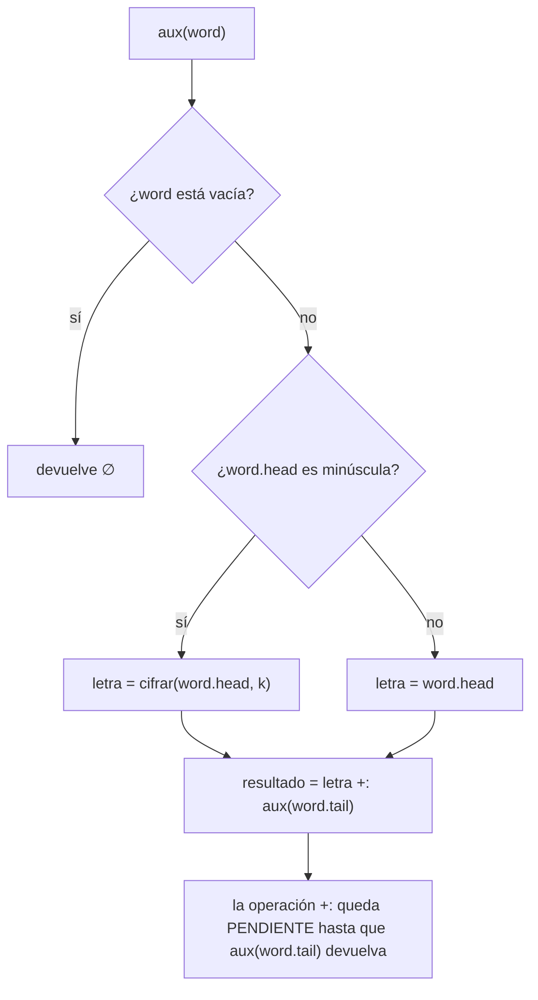

### 1.2 Ejecución paso a paso: `cesar("casa", 3)`

Cálculo de cada letra con $k=3$:

| Letra | $p$ | $(p+3) \bmod 26$ | Letra cifrada |
|---|---|---|---|
| c | 2 | 5 | f |
| a | 0 | 3 | d |
| s | 18 | 21 | v |
| a | 0 | 3 | d |

**Diagrama de secuencia.** Cada flecha hacia la derecha es una llamada (la pila crece) y cada flecha punteada es un retorno (la pila decrece):

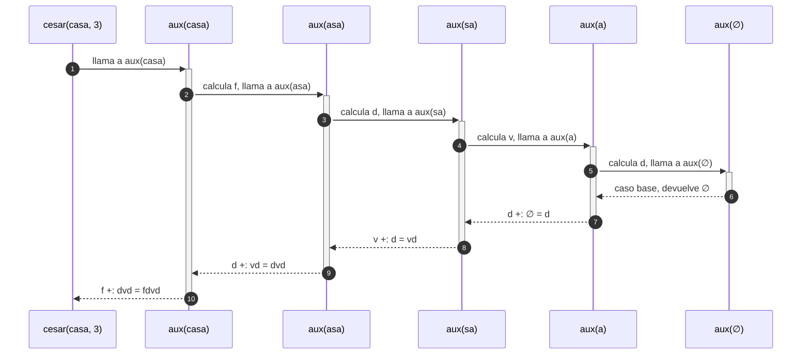

**Estado de la pila en cada punto** (cima → base):

| Punto | Pila (cima → base) | Profundidad |
|---|---|---|
| Entrada | `cesar(casa,3)` | 1 |
| Tras llamar a `aux(casa)` | `aux(casa)` ⟵ `cesar` | 2 |
| Tras llamar a `aux(asa)` | `aux(asa)` (pend. `f +: _`) ⟵ `aux(casa)` ⟵ `cesar` | 3 |
| Tras llamar a `aux(sa)` | `aux(sa)` (pend. `d +: _`) ⟵ `aux(asa)` ⟵ `aux(casa)` ⟵ `cesar` | 4 |
| Tras llamar a `aux(a)` | `aux(a)` (pend. `v +: _`) ⟵ `aux(sa)` ⟵ `aux(asa)` ⟵ `aux(casa)` ⟵ `cesar` | 5 |
| Tras llamar a `aux(∅)` (**máxima**) | `aux(∅)` ⟵ `aux(a)` ⟵ `aux(sa)` ⟵ `aux(asa)` ⟵ `aux(casa)` ⟵ `cesar` | 6 |
| `aux(∅)` devuelve `∅` | `aux(a)` ⟵ `aux(sa)` ⟵ `aux(asa)` ⟵ `aux(casa)` ⟵ `cesar` | 5 |
| `aux(a)` devuelve `d` | `aux(sa)` ⟵ `aux(asa)` ⟵ `aux(casa)` ⟵ `cesar` | 4 |
| `aux(sa)` devuelve `vd` | `aux(asa)` ⟵ `aux(casa)` ⟵ `cesar` | 3 |
| `aux(asa)` devuelve `dvd` | `aux(casa)` ⟵ `cesar` | 2 |
| `aux(casa)` devuelve `fdvd` | `cesar` | 1 |

**Pila en el punto de máxima profundidad** (cima arriba):

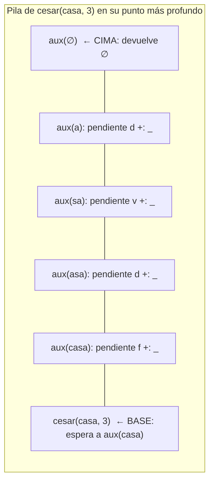

Para un mensaje de $n$ letras la pila llega a $n+2$ marcos (uno de `cesar` y $n+1$ de `aux`): su profundidad crece **linealmente** con $n$.

**Resultado:** `cesar("casa", 3) = "fdvd"`.

### 1.3 Casos especiales

- **Vuelta al principio (`cesar("zzz", 1)`):** $z=25$ y $(25+1) \bmod 26 = 0$, que es la `a`. Resultado: `"aaa"`.
- **$k$ mayor que 26 (`cesar("abc", 29)`):** $(0+29) \bmod 26 = 3$, equivale a $k=3$. Resultado: `"def"`.
- **$k$ negativo (`cesar("fdvd", -3)`):** $f=5$ y $\operatorname{mod}^{+}(5-3) = 2$, que es `c`. Resultado: `"casa"`.
- **Caracteres que no son minúsculas:** `esMinuscula` devuelve `false` y el carácter se antepone sin cambio; el resto del proceso es idéntico.

---

## 2. Punto 2: `cesarCola` (recursión de cola)

### 2.1 Idea del código

`cesarCola(m, k, acc)` lleva un **acumulador** `acc` con lo construido hasta el momento:

1. **Caso base:** si `m` está vacío, devuelve `acc.reverse`.
2. **Caso letra minúscula:** llama a `cesarCola(m.tail, k, letraCifrada +: acc)`.
3. **Otro carácter:** llama a `cesarCola(m.tail, k, m.head +: acc)`.

Como cada letra se **antepone** (`+:`), `acc` queda al revés; por eso el caso base lo invierte con `reverse`.

La llamada recursiva **es lo último que hace la función**: al volver no queda nada por ejecutar. El resultado parcial viaja en `acc`, así que el marco actual puede reemplazarse por el de la nueva llamada.

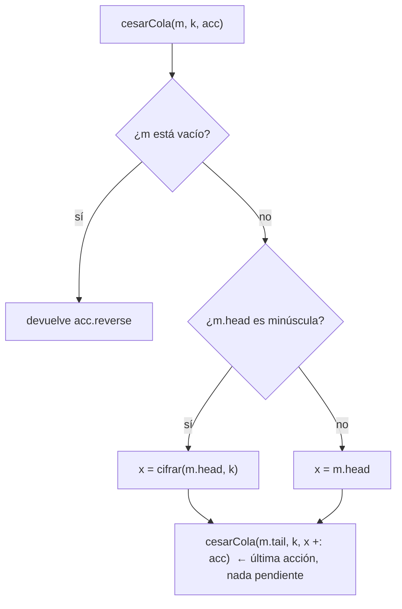

### 2.2 Ejecución paso a paso: `cesarCola("casa", 3)`

| Llamada | `m` | `k` | `acc` al entrar | Letra | `acc` que se pasa |
|---|---|---|---|---|---|
| 1 | `casa` | 3 | `∅` | c → f | `f` |
| 2 | `asa` | 3 | `f` | a → d | `df` |
| 3 | `sa` | 3 | `df` | s → v | `vdf` |
| 4 | `a` | 3 | `vdf` | a → d | `dvdf` |
| 5 | `∅` | 3 | `dvdf` | caso base | `reverse(dvdf) = fdvd` |

**Estado de la pila.** Con recursión de cola, la pila **siempre tiene un solo marco** (además del llamador), y sus parámetros se sobrescriben en cada llamada:

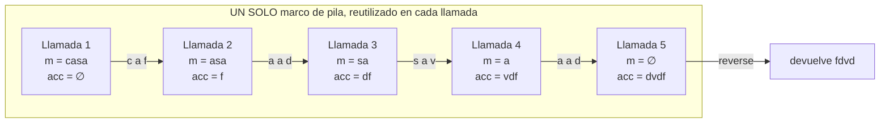

| Punto | Pila (cima → base) | Profundidad |
|---|---|---|
| Llamada 1 | `cesarCola(casa, 3, ∅)` | 1 |
| Llamada 2 | `cesarCola(asa, 3, f)` (mismo marco) | 1 |
| Llamada 3 | `cesarCola(sa, 3, df)` (mismo marco) | 1 |
| Llamada 4 | `cesarCola(a, 3, vdf)` (mismo marco) | 1 |
| Llamada 5 | `cesarCola(∅, 3, dvdf)` (mismo marco) → devuelve `fdvd` | 1 |

**Resultado:** `cesarCola("casa", 3) = "fdvd"`, igual que `cesar`.

### 2.3 Por qué una pila crece y la otra no

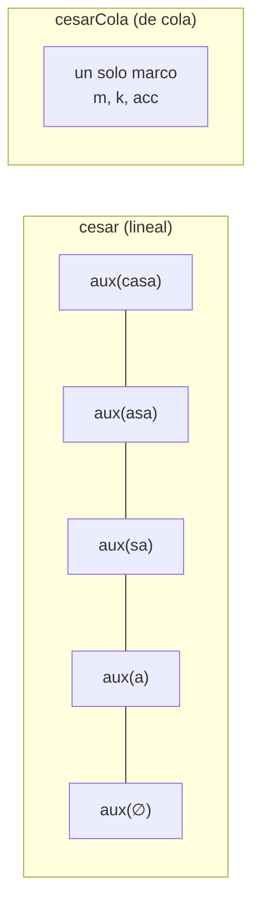

| Aspecto | `cesar` (lineal) | `cesarCola` (de cola) |
|---|---|---|
| Dónde vive el resultado parcial | En operaciones **pendientes** de cada marco | En el parámetro **`acc`** |
| Qué hace la llamada recursiva al volver | Aún debe ejecutar `letra +: resultado` | Nada: devuelve lo que recibe |
| Marcos para `casa` (4 letras) | 5 de `aux` (más el de `cesar`) | 1 |
| Marcos para $n$ letras | $n+1$, crece linealmente | $1$, constante |
| Riesgo con mensajes muy largos | `StackOverflowError` | Ninguno de pila |

**Explicación.** En `cesar`, el marco de cada letra no puede liberarse hasta que la letra siguiente termine, porque todavía le falta anteponer su letra al resultado; por eso los marcos se apilan. En `cesarCola`, cuando se hace la llamada recursiva no queda nada por hacer en el marco actual, así que el compilador lo reutiliza. El proceso es equivalente a un ciclo `while`.

### 2.4 Nota sobre `@tailrec`

El enunciado pide anotar la función con `@tailrec`. La definición correcta es:

```scala
@tailrec
final def cesarCola(m: Mensaje, k: Int, acc: Mensaje = ""): Mensaje = { /* ... */ }
```

Con la anotación, el compilador **verifica** que la llamada recursiva esté en posición de cola y da error si no lo está. La función ya cumple esa condición, así que compila sin cambios en la lógica.

---

## 3. Punto 3: `frecuencias`

### 3.1 Idea del código

1. **Recorrido de cola** con `aux(word, acc)`, donde `acc` es un `Map[Char, Int]` con los conteos hasta el momento:
   - `word` vacía: devuelve `acc`.
   - Letra minúscula: llama a `aux(word.tail, acc + (letra -> (acc.getOrElse(letra, 0) + 1)))`.
   - Otro carácter: llama a `aux(word.tail, acc)` sin modificar el mapa.
2. **Ordenamiento final:** `.toList.sortBy(w => (-w._2, w._1))`. `sortBy` ordena ascendente; con el conteo negado, queda **descendente por frecuencia**, y la letra desempata en orden **alfabético**.

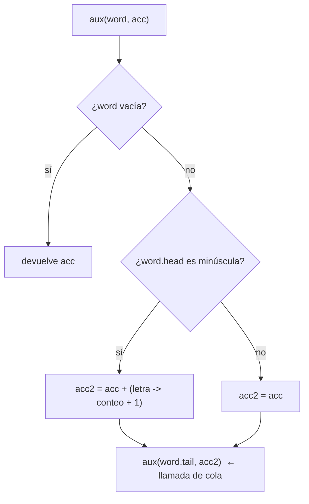

### 3.2 Ejecución paso a paso: `frecuencias("casa")`

| Llamada | `word` | Letra | `acc` que se pasa |
|---|---|---|---|
| 1 | `casa` | c (nueva) | `Map(c→1)` |
| 2 | `asa` | a (nueva) | `Map(c→1, a→1)` |
| 3 | `sa` | s (nueva) | `Map(c→1, a→1, s→1)` |
| 4 | `a` | a (ya estaba, $1+1$) | `Map(c→1, a→2, s→1)` |
| 5 | `∅` | caso base | devuelve `Map(c→1, a→2, s→1)` |

**Estado de la pila.** Igual que en `cesarCola`: un solo marco de `aux` que se reutiliza, debajo del marco de `frecuencias`, que espera el mapa para ordenarlo.

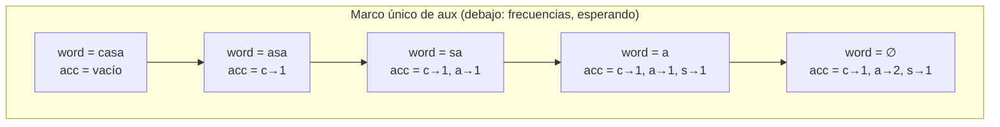

| Punto | Pila (cima → base) | Profundidad |
|---|---|---|
| Llamadas 1 a 5 | `aux(...)` (mismo marco) ⟵ `frecuencias(casa)` | 2 |
| `aux` devuelve el mapa | `frecuencias(casa)` (va a ordenar) | 1 |

**Ordenamiento.** Las claves que se comparan son $(-1,c)$, $(-2,a)$ y $(-1,s)$. De menor a mayor: $(-2,a) < (-1,c) < (-1,s)$.

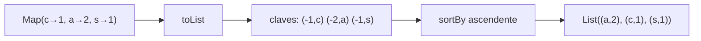

### 3.3 Casos especiales

- `frecuencias("")` y `frecuencias("123 !?")`: los dígitos, espacios y signos no cumplen `esMinuscula`, el mapa nunca cambia y el resultado es `List()`.
- `frecuencias("AaA")`: solo la `a` minúscula cuenta, resultado `List(('a',1))`.

---

## 4. Punto 4: `desplazamientoProbable` y `romperCesar`

### 4.1 `desplazamientoProbable`

**Idea.** Se supone que la letra más frecuente del mensaje original es la `e`. Si en el mensaje cifrado la más frecuente es $x$, el desplazamiento probable es la distancia de `e` a $x$:

$$k_{\text{probable}} = \operatorname{mod}^{+}\big(\operatorname{pos}(x) - \operatorname{pos}(e)\big)$$

**Pasos:**

1. Calcula `frecuencias(m)`.
2. Si la lista está vacía, devuelve 0.
3. Si no, toma la primera tupla (la más frecuente; en empate, la menor alfabéticamente) y calcula `moduloPositivo(letra - 'e', 26)`.

**Ejecución: `desplazamientoProbable("hhhaaa")`**

| Paso | Qué ocurre | Valor |
|---|---|---|
| 1 | `frecuencias("hhhaaa")` | `List(('a',3), ('h',3))` (empate: gana `a`) |
| 2 | ¿lista vacía? | No |
| 3 | Letra más frecuente | `'a'` |
| 4 | `'a' - 'e'` | $97 - 101 = -4$ |
| 5 | `moduloPositivo(-4, 26)` | $((-4 \bmod 26)+26) \bmod 26 = 22$ |

**Estado de la pila:**

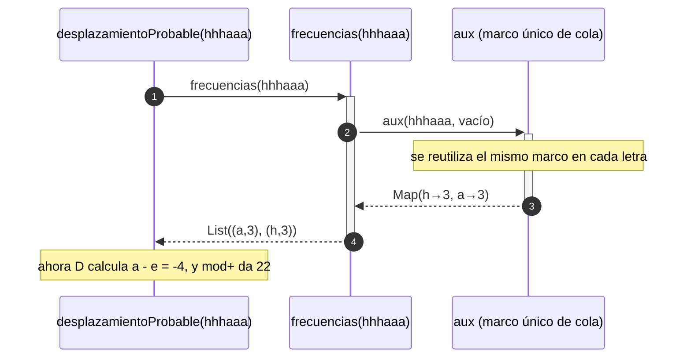

| Punto | Pila (cima → base) | Profundidad |
|---|---|---|
| Entrada | `desplazamientoProbable` | 1 |
| Durante `frecuencias` | `aux` ⟵ `frecuencias` ⟵ `desplazamientoProbable` | 3 |
| Tras `frecuencias` | `desplazamientoProbable` (hace la resta y el módulo) | 1 |

**Otros casos:** `"h"` da $7-4=3$; `"123"` da lista vacía y por tanto 0.

### 4.2 `romperCesar`

**Idea.** Estima el desplazamiento y descifra aplicando el desplazamiento **negativo** con `cesar`: `cesar(m, -desplazamientoProbable(m))`.

**Ejecución: `romperCesar("ls")`** (es `"el"` cifrado con $k=7$)

1. Primero se evalúa el argumento `-desplazamientoProbable("ls")`:
   - `frecuencias("ls") = List(('l',1), ('s',1))` (empate: gana `l`).
   - $\operatorname{pos}(l)-\operatorname{pos}(e) = 11-4 = 7$, y con el signo el argumento es $-7$.
2. Recién entonces se llama a `cesar("ls", -7)`:
   - l: $\operatorname{mod}^{+}(11-7) = 4$, que es `e`.
   - s: $\operatorname{mod}^{+}(18-7) = 11$, que es `l`.
3. Resultado: `"el"`.

**Estado de la pila.** Las dos fases **no coexisten**: `desplazamientoProbable` termina antes de que `cesar` empiece.

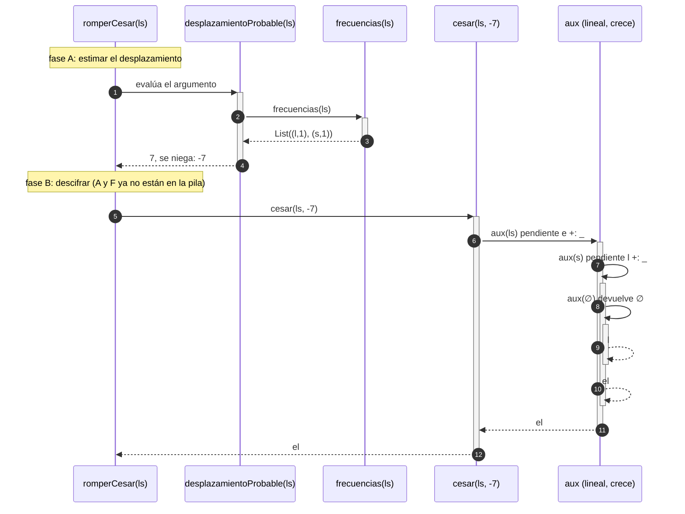

| Fase | Pila (cima → base) | Profundidad |
|---|---|---|
| A: durante `frecuencias` | `aux` ⟵ `frecuencias` ⟵ `desplazamientoProbable` ⟵ `romperCesar` | 4 |
| A: terminó | `romperCesar` | 1 |
| B: punto más profundo | `aux(∅)` ⟵ `aux(s)` ⟵ `aux(ls)` ⟵ `cesar` ⟵ `romperCesar` | 5 |

La fase de descifrado hereda el comportamiento de `cesar`: la pila crece linealmente con la longitud del mensaje.

---

## 5. Punto 5: `combinaciones` y `vigenere`

### 5.1 `combinaciones(n, a)`

**Idea.** Se implementa la forma cerrada $C(n,a)=a\,(a-1)^{n-1}$:

- Si `n == 0`, devuelve `BigInt(1)`.
- Si no, devuelve `BigInt(a) * aux(n - 1, BigInt(1))`, donde `aux(n_aux, acc)` multiplica `acc` por $(a-1)$ un total de `n_aux` veces con recursión de cola.

Se usa `BigInt` porque los valores crecen muy rápido: por ejemplo $C(20,26)=26\cdot 25^{19}$ no cabe en un `Int`.

**Ejecución: `combinaciones(3, 26)`**

| Llamada | `n_aux` | `acc` al entrar | Acción |
|---|---|---|---|
| 1 | 2 | 1 | `aux(1, 1 * 25 = 25)` |
| 2 | 1 | 25 | `aux(0, 25 * 25 = 625)` |
| 3 | 0 | 625 | caso base, devuelve 625 |

Resultado final: $26 \cdot 625 = 26\cdot 25^{2} = 16250$.

**Estado de la pila.** `combinaciones` queda **esperando** el valor de `aux` (todavía debe multiplicar por `a`), pero `aux` usa un solo marco:

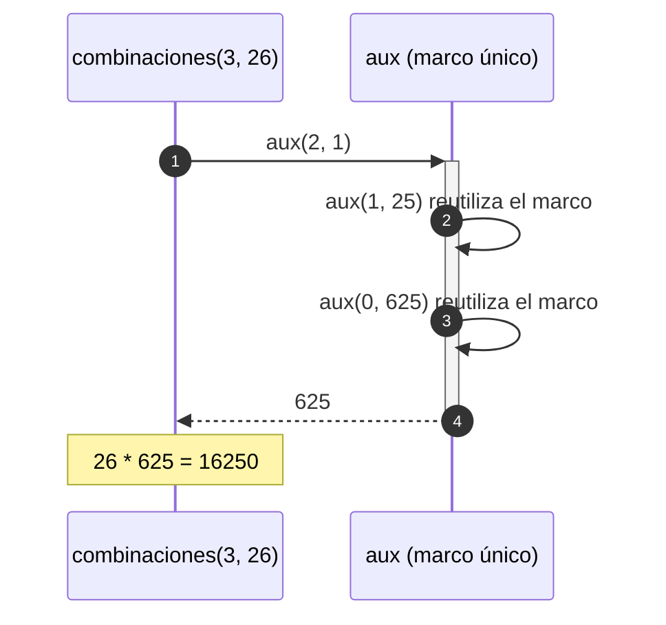

| Punto | Pila (cima → base) | Profundidad |
|---|---|---|
| `aux(2,1)` | `aux(2,1)` ⟵ `combinaciones` (pend. `26 * _`) | 2 |
| `aux(1,25)` | `aux(1,25)` (mismo marco) ⟵ `combinaciones` | 2 |
| `aux(0,625)` | `aux(0,625)` (mismo marco) ⟵ `combinaciones` | 2 |
| Final | `combinaciones` | 1 |

La profundidad es 2 para cualquier $n$.

**Otros casos:** `combinaciones(2, 2)` da $2\cdot 1^{1}=2$; `combinaciones(2, 1)` da $1\cdot 0^{1}=0$.

### 5.2 `vigenere(m, clave)`

**Idea.** Cada letra minúscula se desplaza según la letra de la clave que le toca, tomada como `clave(idx % clave.length)`. Si el carácter **no** es una minúscula, se copia y `idx` **no avanza** (no consume clave). Si la clave está vacía, devuelve `m`.

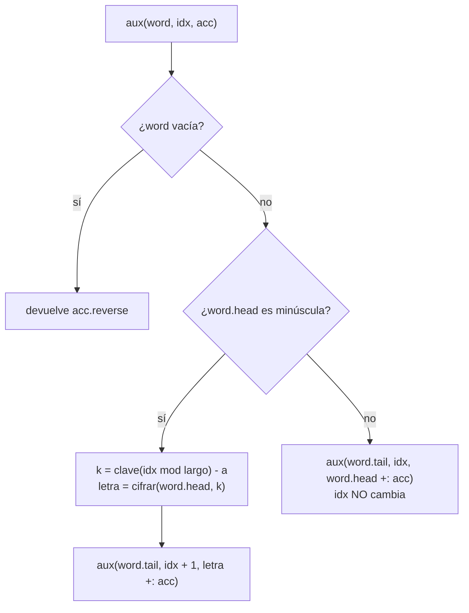

**Ejecución: `vigenere("ataque", "sol")`**

Desplazamientos de la clave: $s=18,\ o=14,\ l=11$.

| Llamada | `word` | `idx` | Clave | $k$ | Cálculo | Cifrada | `acc` que se pasa |
|---|---|---|---|---|---|---|---|
| 1 | `ataque` | 0 | s | 18 | $(0+18)\bmod 26=18$ | s | `s` |
| 2 | `taque` | 1 | o | 14 | $(19+14)\bmod 26=7$ | h | `hs` |
| 3 | `aque` | 2 | l | 11 | $(0+11)\bmod 26=11$ | l | `lhs` |
| 4 | `que` | 3 | s | 18 | $(16+18)\bmod 26=8$ | i | `ilhs` |
| 5 | `ue` | 4 | o | 14 | $(20+14)\bmod 26=8$ | i | `iilhs` |
| 6 | `e` | 5 | l | 11 | $(4+11)\bmod 26=15$ | p | `piilhs` |
| 7 | `∅` | 6 | — | — | caso base | — | `reverse(piilhs) = shliip` |

Resultado: `"shliip"`.

**Estado de la pila.** `aux` es de cola: un solo marco cuyos parámetros cambian. La función externa `vigenere` no deja nada pendiente porque `aux(m)` es lo último que hace.

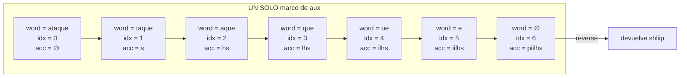

| Punto | Pila (cima → base) | Profundidad |
|---|---|---|
| Llamadas 1 a 7 | `aux(...)` (mismo marco) | 1 |

**Caso con espacio: `vigenere("hola mundo", "ab")`**

| Carácter | `idx` al procesarlo | Clave | Resultado |
|---|---|---|---|
| h | 0 | a | h |
| o | 1 | b | p |
| l | 2 | a | l |
| a | 3 | b | b |
| (espacio) | 4 | no consume | espacio; `idx` sigue en 4 |
| m | 4 | a | m |
| u | 5 | b | v |
| n | 6 | a | n |
| d | 7 | b | e |
| o | 8 | a | o |

Resultado: `"hplb mvneo"`. La `m` usa la clave `a` porque el espacio no avanzó `idx`.

---

## 6. Resumen y observaciones

| Función | Tipo de recursión | Marcos de pila | Dónde guarda el resultado parcial |
|---|---|---|---|
| `cesar` | Lineal | $n+2$ (crece) | Operación pendiente `letra +: _` en cada marco |
| `cesarCola` | De cola | $1$ | Parámetro `acc` (se invierte al final) |
| `frecuencias` | De cola (en `aux`) | $2$ | Parámetro `acc: Map` |
| `desplazamientoProbable` | No recursiva (usa `frecuencias`) | hasta 3 | — |
| `romperCesar` | No recursiva (usa `cesar`) | crece como `cesar` | — |
| `combinaciones` | De cola (en `aux`) | $2$ | Parámetro `acc: BigInt` |
| `vigenere` | De cola (en `aux`) | $1$ | Parámetros `idx` y `acc` |

**Observaciones sobre el código:**

1. **Falta `@tailrec`.** El enunciado lo exige en `cesarCola`. Conviene ponerlo también en los `aux` de cola (`frecuencias`, `combinaciones`, `vigenere`) para que el compilador garantice que lo son.
2. **Comentario inexacto en `combinaciones`.** El comentario junto a `BigInt(a) * aux(...)` habla de "acumular marcos de pila", pero `aux` es de cola y no los acumula.
3. **Pila constante no es memoria constante.** `m.tail` y `+:` sobre `String` crean copias nuevas, así que el tiempo total es cuadrático, $O(n^2)$, en la longitud del mensaje. La pila sí es constante, que es lo que pide el taller.
4. **Funciones auxiliares.** Todas las funciones auxiliares (`aux`, `moduloPositivo`) están definidas **dentro** de las funciones que las usan, como pide el enunciado. `esMinuscula`, `letras` y `primera` vienen del material.

---

## Anexo: cuándo falla `romperCesar`

El método supone que la letra más frecuente del mensaje original es la `e`. **Falla cuando esa suposición es falsa**: textos cortos, textos con muchas repeticiones de otra letra o textos que no están en español.

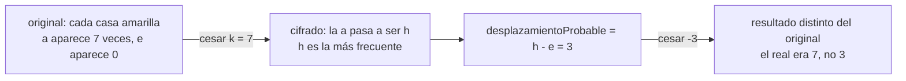

**Mensaje concreto donde falla:** `"cada casa amarilla"`.

1. En el original, `a` aparece 7 veces ($2+2+3$) y `e` aparece 0 veces.
2. Se cifra con $k=7$: la `a` pasa a ser `h`, que sigue siendo la más frecuente.
3. `desplazamientoProbable` calcula $\operatorname{pos}(h)-\operatorname{pos}(e)=3$ en lugar del 7 real.
4. `romperCesar` descifra con $-3$ y obtiene un texto distinto del original, así que `romperCesar(cesar(original, 7)) != original`.

**Segundo ejemplo:** `"zzzz zzzz zzzz"` cifrado con $k=3$ queda `"cccc cccc cccc"`. La más frecuente es `c`, el desplazamiento estimado es $\operatorname{mod}^{+}(2-4)=24$, y al descifrar con $-24$ se obtiene `"eeee eeee eeee"`, no el original.

También puede fallar por **empates**: si la `e` empata con otra letra, se elige la menor alfabéticamente, que puede no ser la correcta.
